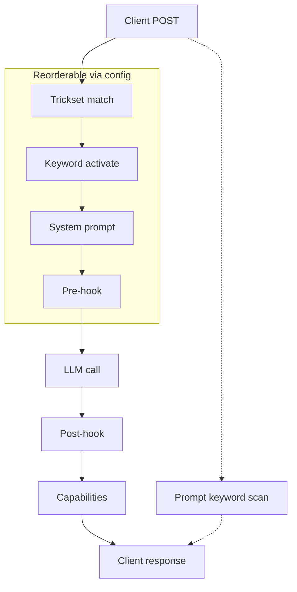

<p align="center">
<br/>
<a href=https://pypi.org/project/petsitter></a>
</p>

## Intro

Petsitter sits between the tools you already use and the AI provider they talk to.

That's really all it is: a small thing running on your own machine that requests
pass through on their way out, and replies pass through on their way back. Your
tools don't need to know it's there, and nothing about the way you work has to
change.

Once something is sitting in the middle, a few things become possible:

- **You can see what's actually being sent.** Every request and every reply, as
  it happens. Most of the time you'll never think about this — right up until
  something behaves oddly and you'd really like to look. *([see how](#traffic-logger))*

- **You can help a model along.** Some models are shaky at tool calling, or hand
  back JSON that doesn't quite parse. Petsitter can smooth that over in the
  middle, so you don't have to change your tools or go find a bigger model.
  *([see how](#tool-calling))*

- **You can keep private things private.** API keys and personal details can be
  taken out before anything leaves your machine. *([see how](#secrets-protector))*

None of it is on until you turn it on, and you can take it back out whenever you
like — point your tool back where it was and it's as if petsitter had never been
there.

```bash
uvx petsitter
```

Nothing else to set up. Have a look around, and if none of it is useful, no harm
done.


## A bit more precisely

**Petsitter** is an OpenAI-compatible proxy that layers smart harnesses on top of language models to give them capabilities they don't natively have. It also makes finicky behaviors reliable and dependable.

You install it, point it at a model, load a few example tricks, and suddenly things that model couldn't do before such as tool calling, structured JSON, multi-step reasoning start working. You can also protect secrets, have memory, share server instances across harnesses, and extend the tool trivially.

The built-in tricks are starting points. Tweak them, combine them, or use them as a reference to build something entirely different. Petsitter isn't a turnkey product; it's a kit.

## How It Works


Petsitter intercepts every request/response pair and runs it through a pipeline of hooks. Each trick picks which hooks it needs:

1. **`system_prompt`** - Inject instructions before the model sees the conversation
2. **`pre_hook`** - Modify messages or inject tool definitions before the API call
3. **`post_hook`** - Validate, retry, or transform the model's response
4. **`info`** - Declare capabilities back to your application

Tricks also have lifecycle hooks (`install`, `startup`, `shutdown`, `uninstall`) for managing resources across their lifetime.

A trick can be as simple as appending a sentence to the system prompt, or as involved as routing subtasks to three different models in parallel. There's a GUI at `/` with tabs for managing tricksets and their tricks (Tricks / Models / Agents), a live activity log (Logs), and per-trickset logging configuration (Settings).

The Tricks tab lists your local `tricks/*.py` alongside [community tricks](#community-tricks) published by other people, and the speech-bubble button in the header opens a [Try It panel](#try-it) that sends a message through the pipeline so you can watch which tricks fire.

You can also edit tricks, reorder them, disable, add new ones, and filter them:


*Petsitter* is part of the [DAY50](https://github.com/day50-dev/) suite of open-source tools for local AI workflows and constructing better agents.

The core goals of Petsitter are:
- **No model changes required** - Works with any OpenAI-compatible endpoint
- **Pluggable architecture** - Write your own tricks in Python. (Skills are included in `.agents`)
- **Transparent to your app** - Point your existing code at petsitter instead of the model
- **Mix and match** - Combine multiple tricks for compound effects

---

## Quick Start

Quickest way:

```bash
$ uvx petsitter
```

Or you can do one off invocation:
```bash
# Run petsitter, reading settings from the default config file
# (~/.config/petsitter/config.json, or $PET_CONFIG_DIR)
petsitter -l localhost:8080

# Or point at a specific config file (model, tricksets, etc. all live there)
petsitter -c another_petsitter_config.conf.json -l localhost:8080
```

Configure the upstream model, tricksets, and modelset via the dashboard at `http://localhost:8080` or the `pet` CLI — everything is persisted to the config file, so a plain `petsitter` starts the same way next time. `pet` accepts the same `-c` flag (before the subcommand, e.g. `pet -c another_petsitter_config.conf.json ls`) so both tools can target the same config area.

Either way, now you can point your AI applications to `http://localhost:8080/v1` and you're going through the petsitter middleware.

## Zero-Config Host Override (`/p/`)

The `/p/` route is the easy way to proxy an existing endpoint: prefix whatever host you already use with `http://localhost:8080/p/` and petsitter handles the rest. No trickset to create, no model config to swap.

```
# Instead of https://build.nvidia.com/...
http://localhost:8080/p/build.nvidia.com/...
```

Point your client's `base_url` at `http://localhost:8080/p/<host>` and petsitter forwards everything after the host to `https://<host>/<rest>` - whatever path the client appends. It's a dumb-client-friendly trick: the client just appends `/chat/completions`, `/v1/models`, or anything else to the base you give it, and petsitter proxies it through the normal trick pipeline.

Key behaviors:

- **HTTPS only** - the upstream host is always assumed `https://`. This is a convenience feature for public endpoints.
- **Auth passthrough** - your client's `Authorization` header is forwarded to the upstream, so each host's own API key works.
- **Model passthrough** - the request's `model` field goes upstream as-is.
- **Trickset selection** relies on the existing `X-Title`/`Model` filters - no special handling, the `/p/` path only overrides the upstream host.
- Chat completions (streaming included), model listings, and any other path under `/p/` are proxied.

```bash
curl http://localhost:8080/p/build.nvidia.com/v1/chat/completions \
  -H "Authorization: Bearer <your-nvidia-key>" \
  -d '{"model":"meta/llama-3.3-70b-instruct","messages":[{"role":"user","content":"hi"}]}'
```

## Config Diagnostic (`__petsitter_config__`)

Send a single user message containing exactly `__petsitter_config__` and petsitter answers with a snapshot of its configuration instead of calling the upstream model:

```bash
curl http://localhost:8080/v1/chat/completions \
  -H "Content-Type: application/json" \
  -d '{"model":"my-model","messages":[{"role":"user","content":"__petsitter_config__"}]}'
```

The request is an **exact copy of the real traversal**: it runs the same keyword filtering, trickset selection, system-prompt injection, and pre-hooks, and builds the actual upstream URL, payload, and headers that a real request would use — then returns a snapshot in place of the upstream HTTP call. No upstream request is made, and your API key is never included (only its presence as `"set"`, `"bearer"`, or `"none"`).

The snapshot includes:

- **`model`** - configured upstream URL, model name, key presence, and the resolved target URL
- **`request`** - `X-Title`, model, `stream`, plus `original_messages` vs `transformed_messages` (exactly what upstream would receive) and the would-be upstream `payload`/`url`/`auth`
- **`trickset`** - the matched trickset and each active trick (class, display name, keywords, per-trick config)
- **`tricksets`** - every loaded trickset and `capabilities`

It works on `/v1/chat/completions` and `/p/<host>/.../chat/completions`, and honors `stream: true` (returned as a normal chunked stream). It only triggers on an exact full-message match, so ordinary conversation is unaffected.

## CLI Options

| Option | Short | Description |
|--------|-------|-------------|
| `--config` | `-c` | Path to a config file (e.g., `another_petsitter_config.conf.json`) or a config directory. Defaults to `$PET_CONFIG_DIR` if set, else `~/.config/petsitter`. Tricksets live in `<base>/tricksets`. |
| `--listen` | `-l` | Host:port to listen on (default: `localhost:8080`) |
| `--version` | `-v` | Show version and exit |

### `pet` subcommands

`pet` edits the same JSON files the dashboard writes, so the two always agree and neither needs the server running. `pet --help` lists everything; the ones worth knowing:

| Command | What it does |
|---------|--------------|
| `pet ts` | List tricksets; `pet ts <name>` for detail, `pet ts <name> <trick> <param> <value>` to set one |
| `pet tricks` | List available local trick modules |
| `pet add` / `pet rm` | Add or remove a trick from a trickset |
| `pet search [query]` | Search the [community index](#community-tricks) |
| `pet cat <owner>/<name>` | Print a community trick's source without installing it |
| `pet install <owner>/<name>` | Install from the index (a bare name instead runs a local trick's `install()` hook) |
| `pet installed` | List tricks installed from the index |
| `pet publish <trick>` | Publish a trick to the index |
| `pet model` | Show or set model config; `pet model _default > f.json` / `cat f.json \| pet --import model` backs up and restores the whole modelset |
| `pet agents` | List, register, unregister harness agents |

## Community Tricks

Tricks are shareable. Anyone can publish one, and they show up in everyone's dashboard within the hour, in the **Available Tricks** list on the Tricks tab, next to your local ones.

**There is no registry server.** The index is a static `index.json` in [day50-dev/tricks](https://github.com/day50-dev/tricks), rebuilt hourly by a GitHub Action that crawls public repos carrying the topic `petsitter-trick`. No accounts, no approval queue, nothing to keep running.

### Installing

From the dashboard, hit **Install** on any community entry. It downloads, verifies the checksum, and adds it to the selected trickset. Or from the CLI:

```bash
pet search tool                  # search the index
pet cat dana/ollama-ctx          # read the source first
pet install dana/ollama-ctx --trickset opencode
```

Installed tricks land at `<config>/tricks/<owner>/<slug>/<version>.py`, and tricksets refer to them with a `pkg:` spec rather than a path:

```json
{
  "name": "my-trickset",
  "tricks": [
    "tricks/json_mode.py",
    "pkg:dana/ollama-ctx@0.1.0"
  ]
}
```

The `pkg:` form is what makes a trickset portable. The same JSON works on another machine, where a `/home/you/...` path would not. Omit `@version` and the newest installed version is used.

Point at a different index (a private one for your org, say) with `PET_REGISTRY_INDEX`, either an `https://` or a `file://` URL. The index is cached for an hour; a stale cache is preferred to an error, so the list still works offline.

### Publishing

Three steps, no ceremony:

1. **Put a `__version__` on your Trick subclass.** Semver, bumped whenever the file changes.
2. **Push it to a public GitHub repo.** Root or a `tricks/` directory, as many tricks per repo as you like.
3. **Add the topic:** `gh repo edit --add-topic petsitter-trick`

`pet publish tricks/my_trick.py` runs steps 2 and 3 for you and checks step 1 first.

```python
class OllamaCtxTrick(Trick):
    __version__ = "0.1.0"
    __brief__ = "Clamps num_ctx for ollama backends"
    __display_name__ = "Ollama Context Clamp"
```

Everything in the index is derived from that file and the GitHub API. You never type a checksum, a date, or an author:

| Field | Where it comes from |
|-------|---------------------|
| `name` | your GitHub login + the filename, e.g. `dana/ollama-ctx` |
| `version` | `__version__` |
| `brief`, `display_name` | `__brief__`, `__display_name__` (else the class name) |
| `keywords`, `prompt_keyword`, `required_models` | the class attributes |
| `url` | pinned to a commit SHA, so the bytes can never change under someone |
| `sha256` | computed from those bytes; `pet install` refuses on a mismatch |
| `repo`, `stars`, `license`, `updated` | the GitHub API |

Names can't collide between authors, because your GitHub login is the namespace, so there is nothing for anyone to adjudicate and publishing needs no permission. The crawler parses candidate files with `ast`; it never imports or executes them.

To update, bump `__version__` and push. To unpublish, delete the repo or drop the topic. Anyone who already installed it keeps their copy, since the file is on their disk.

`featured.json` in the index repo controls which tricks appear before you click **Show N more community tricks**. It's promotion, not permission: nothing is ever kept out of the index for being unfeatured.

> A trick is Python that runs inside petsitter with your API keys, the same trust model as any pip package. `pet cat` and the dashboard's **Read** button exist because a trick is one short file, a good deal more reviewable than the average dependency.

## Try It

The speech-bubble button in the header opens a conversation panel docked over the dashboard. Type a message and it goes through `chat_completions()` exactly as a real client's would: same trickset matching, same keyword gating, same hooks, same upstream. It is not a simulation.

What comes back with each reply:

- **A pill per trick.** Bright means it changed something, and the tooltip lists the stages it ran (`Ran: system_prompt, post_hook`). Dim means it was loaded but did nothing.
- **Why a trick stayed quiet.** A keyword-gated trick that didn't fire reads `Did not fire, needs keyword: banana`.
- **Timing and tokens**, next to the trickset that handled it.
- **The rows light up.** Tricks that actually did something pulse in the Loaded Tricks list, so you can watch a reorder or a config change take effect.

Drag the panel by its header to move it, drag its corner to resize, and `⇲` snaps it back to the bottom right. Whether it's open, where it sits, and the conversation itself are all remembered across refreshes.

It targets whichever trickset is selected in the pill bar, so switching tricksets switches what you're testing.

## Creating Custom Tricks


Tricks also have lifecycle hooks that run outside the request pipeline: `install()` on add, `startup()` on first concurrent use, `shutdown()` on last concurrent finish, and `uninstall()` on removal.

Here is a minimal trick that stops the model from using em-dashes (the long dash character that LLMs love to overuse) and replaces them with regular hyphens:

```python
"""No Em-Dash trick - replaces em-dashes with hyphens."""

from petsitter.trick import Trick

EMDASH = "\u2014"

class NoEmDashTrick(Trick):
    __brief__ = "Replaces em-dashes with hyphens in model responses"
    __display_name__ = "No Em-Dash"

    def system_prompt(self, to_add: str) -> str:
        return "Do NOT use em-dashes. Use a regular hyphen (-) instead."

    def post_hook(self, context: list) -> list:
        if not context:
            return context
        last = context[-1]
        content = last.get("content", "")
        if EMDASH in content:
            content = content.replace(EMDASH, "-")
            last["content"] = content
        return context
```

The `Trick` class has four optional request hooks and optional keyword activation:

### `system_prompt(to_add: str) -> str`

**When:** Called once per request, before any messages are sent to the model.

**Purpose:** Append instructions to the system prompt. This is how you "prime" the model to behave a certain way.

**Example:**
```python
def system_prompt(self, to_add: str) -> str:
    return "IMPORTANT: Respond only in valid JSON. No markdown, no explanations."
```

By default the returned text is **appended** to any existing system prompt, deduplicated so repeated injection doesn't stack. If a trick genuinely needs to *replace* the whole system prompt (e.g. swapping in a complete harness), set `replace_system_prompt = True` on the class:

```python
class SwapHarnessTrick(Trick):
    replace_system_prompt = True

    def system_prompt(self, to_add: str) -> str:
        return "FULL REPLACEMENT PROMPT"
```

### `pre_hook(context: list, params: dict) -> list`

**When:** Called after the system prompt is set, before the model receives the messages.

**Purpose:** Modify the conversation context. You can inject tool definitions, add few-shot examples, or restructure messages.

**Parameters:**
- `context`: List of message dicts (`[{"role": "user", "content": "..."}]`)
- `params`: Request parameters including `tools`, `temperature`, etc.

**Example:**
```python
def pre_hook(self, context: list, params: dict) -> list:
    if "tools" in params:
        tools_json = json.dumps(params["tools"])
        context[0]["content"] += f"\n\nAvailable tools: {tools_json}"
    return context
```

### `post_hook(context: list) -> list`

**When:** Called after the model responds, before the response goes back to your application.

**Purpose:** Validate, transform, or retry. This is where you can:
- Parse the response and convert it to a different format
- Detect when the model failed and call it again with feedback
- Extract tool calls from natural language

**Example (JSON validation with retry):**
```python
def post_hook(self, context: list) -> list:
    attempts = 3
    while attempts > 0:
        try:
            json.loads(context[-1]["content"])
            break
        except json.JSONDecodeError:
            attempts -= 1
            if attempts == 0:
                break
            context = callmodel(context, "That wasn't valid JSON. Try again.")
    return context
```

**Example (Tool call detection):**
```python
def post_hook(self, context: list) -> list:
    content = context[-1]["content"]
    if self._looks_like_tool_call(content):
        context[-1]["tool_calls"] = [self._parse_tool_call(content)]
        context[-1]["content"] = None
    return context
```

### `info(capabilities: dict) -> dict`

**When:** Called when building the response to your application.

**Purpose:** Declare what capabilities this trick provides. Some frameworks check for capabilities before using certain features.

**Example:**
```python
def info(self, capabilities: dict) -> dict:
    capabilities["json_mode"] = True
    capabilities["tools_support"] = True
    return capabilities
```

## Request Metadata

Hooks are handed the conversation, but not everything about the request that produced it — `post_hook` in particular receives only the message list, with no way back to the tools, model, or headers that came with it.

That information travels on a per-request metadata channel. It is backed by a `contextvar`, so every concurrent request gets its own and none can see another's:

```python
from petsitter.observability import request_meta

def pre_hook(self, context: list, params: dict) -> list:
    request_meta()["saw_tools"] = bool(params.get("tools"))
    return context

def post_hook(self, context: list) -> list:
    if not request_meta().get("saw_tools"):
        return context
    ...
```

The proxy fills it in before any hook runs:

| Key | Value |
|---|---|
| `request_id` | Short correlation id — the same one that prefixes this request's log lines |
| `payload` | The full incoming request body |
| `tools` | `payload["tools"]`, or `[]` |
| `model` | The requested model string |
| `stream` | Whether the client asked for a stream |

Tricks are free to add their own keys, and should, whenever they need to carry something from one hook to another within a single request.

**Do not use instance attributes for per-request state.** A trick object is shared across every concurrent request in its trickset, so a `self._something` written in `pre_hook` can be overwritten by a different request before `post_hook` reads it. Reserve instance attributes for configuration and for state that is deliberately long-lived — caches, counters, tallies.

Outside a request — in a lifecycle hook, or a direct call from a test — `request_meta()` returns an inert empty dict, so reads are safe and writes are discarded.

## Lifecycle Hooks

Every trick can implement up to 4 lifecycle hooks that the framework calls automatically:

### `install()`

Called once when the trick is first added to a trickset. Use for one-time setup - clone repos, download files, create resources:

```python
def install(self):
    self.cache_dir = Path("/tmp/my-trick-cache")
    self.cache_dir.mkdir(parents=True, exist_ok=True)
    download_model(self.cache_dir)
```

### `startup()`

Called when the first concurrent request starts using this trick (the internal run counter goes 0→1). Use for per-session initialization. It open connections and preloads models:

```python
def startup(self):
    self.session = httpx.Client()
```

### `shutdown()`

Called when the last concurrent request finishes using this trick (run counter goes 1→0), or during server shutdown for all active tricks. Use for per-session cleanup. It closes connections and release resources:

```python
def shutdown(self):
    self.session.close()
```

### `uninstall()`

Called when the trick is removed from a trickset. Undo anything done during `install()`:

```python
def uninstall(self):
    import shutil
    shutil.rmtree(self.cache_dir, ignore_errors=True)
```

The startup/shutdown hooks use a reference counter so multiple concurrent requests to the same trick won't trigger repeated startup/shutdown calls - `startup()` fires once for the first request, and `shutdown()` fires when the last one finishes.

## Keywords 

### Activation

Set `keywords` on your trick class to activate only when the user includes that word in their message - the keyword is stripped before the model sees it. See [`tricks/multiround.py`](tricks/multiround.py) for a working example.

```bash
# Trick fires when "multiround" is present
curl http://localhost:8080/v1/chat/completions \
  -d '{"messages":[{"role":"user","content":"multiround explain the CAP theorem"}]}'

# Trick does nothing without the keyword
curl http://localhost:8080/v1/chat/completions \
  -d '{"messages":[{"role":"user","content":"explain the CAP theorem"}]}'
```

### Prompts

Prompt keywords let you inject commands to petsitter itself inline in your message using the format `(<keyword>: <request>)`. The framework scans for registered keywords, strips the matching pattern before the model sees it, and routes the request to the appropriate handler.

The syntax is forgiving - a registered keyword can be triggered any of these ways:

- `(swapharness: opencode/claude.md)` - parenthesized with a request
- `(swapharness:opencode/claude.md)` - the space after the colon is optional
- `(swapharness:)` or `(swapharness)` - empty request (e.g. list the harness tree)
- just `swapharness` - a bare keyword alone in a message means an empty request

This is separate from trick [keyword activation](#activation) - keywords activate or deactivate tricks for the current request, while **prompt keywords** are commands to petsitter that bypass the model entirely.

### How to register a prompt keyword

Set `prompt_keyword` on your Trick subclass:

```python
class MyCommandTrick(Trick):
    prompt_keyword = "mycommand"
    __brief__ = "Handles (mycommand: ...) inline requests"

    def handle_prompt_keyword(self, request: str) -> dict | None:
        return {"role": "assistant", "content": f"You asked: {request}"}
```

The method receives the text after `mycommand: ` and can return:
- A message dict - injected as the model response (bypasses the upstream call)
- `None` - the pattern is stripped but the normal pipeline continues

### Notes

- Execution goes in order of the prompt reference. Unrecognized prompt keywords are passed through and surface as a non-critical error in the response along with the rest of the response
- The pattern `(<keyword>: <request>)` properly handles nested parentheses by tracking a depth counter.
- Keyword matching is case-insensitive.
- If the handler raises, an error message is returned as the assistant response.

## Reference Templates

Tricks are managed with `pet` and grouped into [tricksets](#tricksets); there are no
per-trick command-line flags. Point petsitter at a model once, make a trickset,
and add tricks to it:

```bash
pet model default url http://localhost:11434
pet model default model qwen3:8b

pet new mine                    # create a trickset (X-Title '*', Model '*')
pet add mine json_mode          # add a trick to it
petsitter                       # start; settings come from the config file
```

Every example below assumes that, so it only shows the `pet add` line. Swap
`mine` for whichever trickset you're building, or use the dashboard's
Available Tricks list instead.

### Output Control

 * [JSON Mode](#json-mode) - Enforce valid JSON output
 * [Code Validator](#code-validator) - Self-healing validation through model self-description

### Capability Injection

 * [Tool Calling](#tool-calling) - Add tool calling to models without native support
 * [Conversational Tool](#conversational-tool) - ANDYBOT persona tool calling for small/older models 
 * [MCP Tools](#mcp-tools) - Inject tools from an mcp.json file into any harness

### Pipeline

 * [Kennel](#kennel) - Route cognitive subtasks to specialized models
 * [Multi-Model Consultant](#multi-model-consultant) - Two models cross-validate and improve each other's responses

### Security

 * [Secrets Protector](#secrets-protector) - Detect and pseudonymize secrets/PII before they reach the model

### Agent

 * [Swap Harness](#swap-harness) - Browse and swap system prompts from AI tool repositories
 * [Self-Improver](#self-improver) - Runtime agent that can add, modify, and list tricks

### Utility

 * [Rules File](#rules-file) - Inject a shared AGENTS.md-style rules file into the system prompt
 * [Reference Check](#reference-check) - Challenge answers that cite no valid reference from a retrieval tool
 * [Recommender List](#recommender-list) - Make the model pick software from your preferred list
 * [Export It](#export-it) - Export conversation as llcat-compatible JSON
 * [Traffic Logger](#traffic-logger) - Log every request/response as timestamped JSONL to a file

---

### JSON Mode

[tricks/json_mode.py](tricks/json_mode.py)

Enforces valid JSON output by adding formatting instructions to the system prompt, stripping markdown code blocks, and retrying with feedback if the response isn't valid JSON.

```bash
pet add mine json_mode
```

### Code Validator

[tricks/code_validator.py](tricks/code_validator.py)

After the model proposes a code change, asks it to describe what the change does, compares the description against the original user request, and retries with feedback if they don't match.

```bash
pet add mine code_validator
```

### Tool Calling

[tricks/tool_call.py](tricks/tool_call.py)

Enables tool calling for models without native support by injecting tool definitions into the prompt, parsing JSONRPC-style tool call responses, and converting them to OpenAI `tool_calls` format.

```bash
pet add mine tool_call
```

### Conversational Tool

[tricks/conversational_tool.py](tricks/conversational_tool.py)

A conversational approach to tool calling that uses the ANDYBOT persona instead of structured JSON output. The model says `DEAR ANDYBOT, <FUNCTION>` and ANDYBOT collects each parameter through dialogue:

1. Model recognises it needs to call a tool and says `DEAR ANDYBOT, GET_WEATHER`
2. ANDYBOT asks: *"Can you provide location?"*
3. Model responds: `Paris`
4. ANDYBOT builds the tool call and returns it to the application

This works well with small models (3B and under) and older models that struggle with reliable JSON output or native `tool_calls`. The conversational flow lets them express intent naturally instead of wrestling with syntax. It also supports inline arguments (`DEAR ANDYBOT, GET_WEATHER location=Paris`), optional parameters, and "I am confused"/"skip" recovery. The persona is only injected when the request actually carries `tools`.

```bash
pet add mine conversational_tool
pet add mine json_mode
```

### MCP Tools

[tricks/mcp_tools.py](tricks/mcp_tools.py)

Injects tools defined in an [mcp.json](https://github.com/sourcey/mcp-schema) file into any harness. Converts MCP tool definitions to OpenAI function-calling format and merges them into `params["tools"]`. Tools with name collisions take precedence over existing tool definitions.

Default path: `~/.config/petsitter/mcp.json`. Use the `mcp` prompt keyword to switch files at runtime.

```bash
pet add mine mcp_tools          # reads ~/.config/petsitter/mcp.json
```

To point it at a different file, use the `mcp` prompt keyword in a message:
`(mcp: /path/to/my-tools.json)`.

The `mcp.json` format follows the [MCP spec](https://modelcontextprotocol.io):
```json
{
  "mcpSpec": "1.0.0",
  "server": { "name": "my-tools", "version": "1.0.0" },
  "tools": [
    {
      "name": "search_docs",
      "description": "Search documentation by query",
      "inputSchema": {
        "type": "object",
        "properties": {
          "query": { "type": "string" },
          "limit": { "type": "number", "default": 10 }
        },
        "required": ["query"]
      }
    }
  ]
}
```

### Multi-Model Orchestration

A trick has full control of the request lifecycle - it can call any number of models, not just the one the user pointed at. This lets you decompose a problem into subtasks and route each one to the model best suited for it.

Petsitter supports this through **model configs** - JSON files that map role names to `{url, model, key}` objects. Tricks declare what roles they need; if a key is missing, petsitter prints a helpful error.

The `model` and `key` fields can be a string or boolean `false` - `false` means passthrough (don't set the field in the upstream request). This is distinct from `""` which clears the value.

Example `modelset.json`:
```json
{
    "default": {
        "url": "http://localhost:11434",
        "model": "Qwen3.5:8b"
    },
    "thinker": {
        "url": "http://localhost:11434",
        "model": "VibeThinker-3B-GGUF:q4_K_M"
    },
    "toolcall": {
        "url": "http://localhost:11434",
        "model": "lfm2.5:latest",
        "key": "sk-custom-key"
    }
}
```

#### Kennel

[tricks/kennel.py](tricks/kennel.py) is a reference implementation of the pattern above. It routes cognitive subtasks to three specialized models running in parallel - a **thinker** for chain-of-thought, a **tool-caller** for deciding which tools to invoke, and an **emitter** for generating the final response.

```bash
# Pull three small models that together fit on modest hardware (< 6B total)
ollama pull VibeThinker-3B    # reasoning / chain-of-thought
ollama pull LFM2.5-230M       # tool-calling (tiny, fast)
ollama pull Qwen3.5-2B        # response generation

# Each model sees a context optimized for its role
pet new kennel-demo
pet add kennel-demo kennel

# KennelTrick needs three model roles; scope them to this trickset
pet model thinker  url http://localhost:11434 --trickset kennel-demo
pet model thinker  model VibeThinker-3B-GGUF:q4_K_M --trickset kennel-demo
pet model toolcall url http://localhost:11434 --trickset kennel-demo
pet model toolcall model LFM2.5-230M --trickset kennel-demo
pet model default  url http://localhost:11434 --trickset kennel-demo
pet model default  model Qwen3.5-2B --trickset kennel-demo
```

The Models tab in the dashboard does the same thing with fewer keystrokes.

Pipeline:
1. **Thinker** gets the conversation + "think step by step" → produces reasoning
2. **Tool-caller** (if tools are present) gets context + reasoning + tool definitions → decides which tool to call
3. **Emitter** receives the enriched context and generates the final response

Kennel is one architecture; you could write a trick that routes by language, by file type, by user role, or by anything else you can express in a `post_hook`.

#### Multi-Model Consultant

[tricks/multiconsult.py](tricks/multiconsult.py)

Cross-validates responses between two models through iterative refinement and voting. Requires a `default` model and a `consultant` model in the modelset.

Pipeline per round:
1. **model1's** response (from the proxy call) is sent to **model2** for improvement
2. **model2** generates a fresh response to the original prompt
3. **model1** improves model2's fresh response
4. Both models vote on which improved output is better
5. If they agree, return the winner; if not, repeat once more
6. On second disagreement, randomly pick one as fallback

```bash
pet new consult
pet add consult multiconsult
pet model consultant url http://localhost:11434 --trickset consult
pet model consultant model qwen3:8b --trickset consult
```

Example `modelset.json`:
```json
{
    "default": {
        "url": "http://localhost:11434",
        "model": "llama3:8b"
    },
    "consultant": {
        "url": "http://localhost:11434",
        "model": "qwen3:8b"
    }
}
```

### Secrets Protector

[tricks/secrets_protector.py](tricks/secrets_protector.py)

Detects and pseudonymizes sensitive information before it reaches the model, then restores original values in the response:

- **Detection** - regex patterns for API keys (OpenAI, Anthropic, AWS, Google, Stripe), tokens (JWT, GitHub, Slack, Bearer), credentials (database URLs, private keys), and PII (emails, phones, SSNs, credit cards, IPs)
- **Format-preserving substitutes** - realistic replacements (e.g., `alice@example.com` → `user.0001@sanitized.local`) that preserve token boundaries so the model's tokenizer doesn't conflate distinct entries
- **Bidirectional vault** - consistent pseudonyms across the session (same secret → same substitute) with automatic restoration in both natural-language responses and tool call arguments

```bash
pet add mine secrets_protector
```

### Swap Harness

[tricks/swapharness.py](tricks/swapharness.py)

Browses and swaps system prompts from the [system-prompts-and-models-of-ai-tools](https://github.com/x1xhlol/system-prompts-and-models-of-ai-tools) repository. On first use, it clones the repo into `~/.config/petsitter/harnesses/`.

Use the `swapharness` prompt keyword to navigate the directory tree and select a system prompt file. The selected content is injected into the system prompt on every request until a different file is chosen or the trick is uninstalled.

```bash
pet add mine swapharness    # adding it runs install(), which clones the repo
```

Once installed, include `(swapharness: path)` in any user message to browse or select a harness:

```
User: (swapharness: Cursor Prompts)
Assistant: 📁 Cursor Prompts
           📄 Rules for All Models.md
           📄 Rules for Cursor.md
           📄 ...

User: (swapharness: Cursor Prompts/Rules for All Models.md)
Assistant: ✅ Harness set to Cursor Prompts/Rules for All Models.md (2847 chars)
           ────────────────────────────────────────────────
           You are Cursor, an advanced AI coding assistant...
```

The selected system prompt is prepended to every subsequent request. Run `(swapharness: install)` to clone the repo, or use the lifecycle CLI:

```bash
pet install swapharness             # clone the repo
pet uninstall swapharness           # remove the repo
pet lifecycle swapharness startup   # init per-session state
pet lifecycle swapharness shutdown  # cleanup session
```

### Self-Improver

[tricks/self_improver.py](tricks/self_improver.py)

Watches for the prompt keyword `petsitter` in your messages. When it sees `(petsitter: <request>)`, it strips the tag and spawns an agent loop with the default model. The agent has tools to add, modify, and list trick files - it reads instructions from `.agents/skills/self-improver/SKILL.md` to understand the petsitter trick API and conventions.

This is a reference implementation for the **prompt keywords** pattern (see below).

```bash
pet add mine self_improver
```

Example usage:
```
User: (petsitter: add a trick that logs every request to a file)
Model: Creates tricks/request_logger.py and explains how to load it
User: explain the CAP theorem (petsitter: add a thinking mode)
Model: Explains CAP theorem (tag stripped, petsitter handled separately)
```

### Export It

[tricks/exportit.py](tricks/exportit.py)

Exports the conversation history as an [llcat](https://github.com/day50-dev/llcat)-compatible JSON file. The output is the raw message array format used by OpenAI-compatible APIs, making it interoperable with llcat, prompt tools, and anything that speaks the Chat Completions message schema.

Use the `exportit` prompt keyword in any message to trigger the export:

```bash
pet add mine exportit
```

```
User: (exportit)
Assistant: Conversation exported to `/tmp/petsitter/convo-20260718-143022.json` (6 messages, llcat-compatible)

User: (exportit: backup before refactor)
Assistant: Conversation exported to `/tmp/petsitter/convo-20260718-143022.json` (6 messages, llcat-compatible)
Note: backup before refactor
```

The exported JSON is a plain array of messages in OpenAI Chat Completions format:

```json
[
  { "role": "system", "content": "You are a helpful assistant." },
  { "role": "user", "content": "What is the CAP theorem?" },
  { "role": "assistant", "content": "The CAP theorem states...", "tool_calls": [] },
  { "role": "user", "content": "Can you give an example?" },
  { "role": "assistant", "content": "Sure! Consider a distributed..." }
]
```

Tool calls, reasoning (chain-of-thought), and tool results are all preserved in their standard formats. You can load the exported file directly with `llcat -c convo.json` or pipe it into any OpenAI-compatible tool.

### Rules File

[tricks/rules_file.py](tricks/rules_file.py)

Reads a plain-markdown rules file (AGENTS.md / CLAUDE.md style) and injects its content into the system prompt on every request. Because petsitter sits in front of any tool pointed at it, the same rules file applies across opencode, Claude Code, Codex, etc. - write the rules once and keep every harness consistent.

The rules path is configured per-trickset (the scope where petsitter config lives): set the `rules_path` config field on the trick via the dashboard, or switch files at runtime with the `rules` prompt keyword:

```bash
pet add mine rules_file
```

```
User: (rules: /path/to/rules.md)
Assistant: Loaded 123 chars of rules from /path/to/rules.md

User: (rules)
Assistant: Rules loaded from /path/to/rules.md (123 chars)
```

Content is cached and reloaded when the path changes, on startup, or on request. With no path configured the trick stays dormant, so requests pass through untouched.


### Recommender List

[tricks/recommender_list.py](tricks/recommender_list.py)

Keeps a list of the software you actually want used - your database, your package manager, your HTTP client - and injects it into the system prompt, so when the model reaches for "a database" it reaches for yours instead of whatever was most common in its training data. It also carries a do-not-reach-for side, for the things you have already decided against.

The list is configured per-trickset: point `recommender_path` at a text file, put entries inline in `recommendations`, or both. Set `strict` to forbid off-list choices outright instead of asking the model to justify a deviation.

```bash
pet add mine recommender_list
```

The file format is one entry per line, `#` starts a comment:

```
# my stack
database: postgres (already in prod)
package manager: uv
http client: httpx
avoid: mongodb (ops burden)
!jquery
ripgrep
```

A line with a colon (or `=`) is a category choice, a line starting with `!` or `avoid:` / `never` is something to steer away from, and a bare line is a general preference with no category. A trailing `(...)` is kept as a note and passed to the model, so "why" travels with the choice. One category holds one choice - a later entry for the same category replaces the earlier one, which is how inline `recommendations` override the file.

Edit the list at runtime with the `recommend` prompt keyword:

```
User: (recommend)
Assistant: Recommender list (3 entries, from /home/me/.config/petsitter/stack.txt):
           - database: postgres (already in prod)
           - package manager: uv
           - avoid mongodb (ops burden)

User: (recommend: http client = httpx)
Assistant: Recommending: http client = httpx.
           Saved to /home/me/.config/petsitter/stack.txt.

User: (recommend: avoid jquery)
Assistant: Recommending: avoid jquery.
           Saved to /home/me/.config/petsitter/stack.txt.

User: (recommend: drop database)
Assistant: Dropped: database = postgres. Saved to /home/me/.config/petsitter/stack.txt.

User: (recommend: reload)
Assistant: Reloaded the recommender list.
           ...
```

Additions and drops are written back to the file when one is configured, so the list survives a restart; with no file they last for the session. Use `(recommend: reload)` after editing the file by hand. With an empty list the trick stays dormant, so requests pass through untouched.


### Reference Check

[tricks/reference_check.py](tricks/reference_check.py)

Catches the most common shape of hallucination in a retrieval setup: the model either never consults its reference tool, or consults it, finds nothing useful, and answers from memory anyway — sounding exactly as confident as when it is right.

Every result coming back from a reference-ish tool is stamped with an unforgeable `ref_id`, and the model is required to attribute its claims to those ids. A fabricated id is caught immediately:

```
User: What is the Cascade valve rated to?

  (model answers "900 PSI", citing <reference_id: #131>)
  (petsitter: that id was never issued — challenge, content re-presented)
  (model answers "400 PSI", citing ref_id:d65b74455d76)

Assistant: The Cascade valve is rated to 400 PSI.
```

```bash
pet add mine reference_check
```

**It is invisible.** The stamps exist only in the payload sent upstream; the attribution block exists only in the response coming back; both are gone before anything leaves petsitter. The response body a client receives is byte-identical to what the model produced — no badge, no checkmark, no note about what was validated, even when the check fails. That is a correctness requirement rather than a stylistic one: the output may be JSON, graph triples, or anything else with a parser waiting on the other end, and a trick that pollutes it breaks the consumer (and every structural trick stacked after it, such as [JSON Mode](#json-mode)).

#### How it works

**Stamping.** Petsitter never executes the RAG tool — your harness does. But both halves of the round trip pass through the proxy: the tool call goes out in one response, and the tool result comes back in the *next* request as a `role: "tool"` message. So `pre_hook` stamps the result on its way upstream. Nothing needs to integrate with anything; any RAG tool, MCP server, or harness works untouched.

Structured results keep their structure — the id goes in as a `ref_id` field, so anything parsing the tool output still can. Prose results get a stamp per paragraph. Either way you also get one id for the result as a whole.

**Unforgeable, and stateless.** `ref_id = HMAC(per-process secret, tool_call_id + chunk)[:12]`. The HMAC matters twice over. It is *deterministic*, so re-stamping the same chunk on every turn yields the same id — which it must, because your harness resends its own unstamped transcript each time. And it is *unguessable*, so the model cannot manufacture one. Verification then needs no ledger at all: recompute what was issued from the transcript in hand.

That is also why **loading the trick mid-conversation works retroactively** — the first request after you load it stamps every tool result already in the history. Unloading is equally clean; there is no residue in the transcript.

**The challenge.** If the answer carries no valid id, the trick spends tokens rather than failing. It re-presents the retrieved material with its ids and asks again, up to `max_rounds` times. Three situations, three challenges:

| Situation | What happens |
|---|---|
| Cited an id that was never issued | Challenged, and the fabricated id is named |
| Retrieved content present, nothing attributed | Challenged with the content re-presented |
| Never called the tool at all | Challenged to go retrieve; if it responds with a tool call, that goes to your harness to execute |

**`ref_id:none` is a first-class answer.** A model that cannot source a claim is expected to say so, and saying so passes the check. This is load-bearing: if the only outcome of failing were punishment, the cheapest escape would be to forge a *better* id — citing a real id that does not support the claim. An honest exit makes honesty the path of least resistance.

If the model still cannot attribute its answer after `max_rounds`, **the answer is passed through untouched.** The trick is a diagnostic, not a blocker.

#### Configuration

| Field | Default | What it does |
|---|---|---|
| `tool_patterns` | `search,find,research,reference,lookup,retrieve,query,manual,knowledge,doc,wiki,rag,kb,grep,fetch` | Comma-separated substrings. A tool counts as a reference lookup when any appears in its **name or description** — MCP tools are often named `mcp__ctx7__get` while describing themselves plainly. |
| `max_rounds` | `3` | Challenges before giving up. |
| `challenge_missing_call` | `true` | Also challenge answers given without calling a reference tool. The most common failure, and the noisiest check — it fires on any turn that skipped retrieval. |

With no reference-ish tool in the request, the trick is completely dormant.

Per-request state (which tools were in scope, what was stamped) rides the [request metadata channel](#request-metadata) rather than the trick instance, so concurrent requests through the same trickset cannot influence each other's verdicts.

#### Reading the results

Nothing is reported in the response, so the tally comes out of the logger (visible in the dashboard's Logs tab) or on demand:

```
User: (refcheck)
Assistant: Reference check: 12 answers checked, 3 challenged, 1 fabricated ids caught,
           2 claims the model admitted it could not source, 0 passed through after
           exhausting challenges.
```

A run that fires **zero** challenges is a real result — it says the model was not guessing, and you can unload the trick.

#### What it does not do

This is a heuristic, and it buys a large reduction rather than a guarantee. A model can cite a perfectly valid id and still misrepresent what that passage says — quote `ref_id:1313` for the reigning monarch and then attach the same id to a claim about cuttlefish. Nothing here catches that.

It is rarer than it sounds, though, and for a structural reason. To cite an id at all the model has to have attended to that span, since the id exists nowhere else; hallucination is largely what happens when generation runs off parametric memory without looking at the context. Misattribution requires reading the chunk closely enough to lift its id and ignoring it closely enough to say something unrelated. So the main effect is less "we caught a liar" than "we forced attention onto the source."

The corollary is worth keeping in mind: the residual errors that survive this check are *more* dangerous per unit than the ones you started with, because they now read as sourced. Catching those needs a per-claim entailment check against the cited chunk — a model call per claim, a different cost class entirely.

### Traffic Logger

[tricks/logger.py](tricks/logger.py)

Appends one timestamped JSON line to a JSONL file for every request and every response that passes through the trick — the debugging view into whatever harness is misbehaving. Point it at a file, reproduce the problem, and you have the full traffic in both directions: payloads, tools, and messages on the way out; the message list and model answer on the way back.

```bash
pet add mine logger            # writes ~/.cache/petsitter/traffic.jsonl
```

Each request produces two records:

```jsonl
{"timestamp":"2026-08-29T12:00:00.000+00:00","trick":"LoggerTrick","event":"request","direction":"out","request_id":"ab12cd34","x_title":"opencode*","model":"qwen3:8b","stream":false,"tools":[],"payload":{"model":"qwen3:8b","messages":[{"role":"user","content":"hello"}]},"messages":[{"role":"user","content":"hello"}]}
{"timestamp":"2026-08-29T12:00:00.150+00:00","trick":"LoggerTrick","event":"response","direction":"in","request_id":"ab12cd34","x_title":"opencode*","model":"qwen3:8b","messages":[...],"answer":{"role":"assistant","content":"hi!"}}
```

Records come straight off the hooks:

- **`request`** fires in `pre_hook` and carries the full payload and message list heading up — whatever the tricks before it have already done to the conversation.
- **`response`** fires in `post_hook` with the message list including the model's answer.

The trick is passive — both hooks return the context untouched, so nothing it logs changes what the model sees.

#### Ordering matters

Hooks run in trickset order, so where the logger sits decides what it sees:

- **First in the trickset** it records traffic as it arrives from the client.
- **Last in the trickset** it sees the messages after every other trick has rewritten them.

A trick that short-circuits the pipeline (a prompt-keyword handler, or a `post_hook` that replaces the answer) prevents everything after it from running — so add the logger first (or `pet reorder mine logger 0`) to guarantee a record.

#### Configuration

| Field | Default | What it does |
|---|---|---|
| `path` | `~/.cache/petsitter/traffic.jsonl` | Where the JSONL file is written. A directory path (or one ending in `/`) writes `traffic.jsonl` inside it. Parent directories are created on demand. |


## Tricksets

A trickset bundles a group of tricks with routing filters. When a request comes in, petsitter matches the `X-Title` header and `model` field against each loaded trickset's filters, then runs only the tricks from matching sets.

Tricksets live as JSON files in the `tricksets/` directory:

```json
{
  "schema": "0.8.0",
  "name": "my-trickset",
  "filters": {
    "X-Title": "opencode*",
    "Model": "*"
  },
  "tricks": [
    "tricks/json_mode.py",
    "tricks/tool_call.py",
    "pkg:dana/ollama-ctx@0.1.0"
  ],
  "parameters": {},
  "models": {},
  "logfile": "~/.cache/petsitter/tricksets/my-trickset.log",
  "loglevel": "INFO"
}
```

Entries are either a path to a `.py` (absolute, or relative to the repo root) or a `pkg:<owner>/<slug>@<version>` spec pointing at a [community trick](#community-tricks) you've installed.

The `parameters` field stores user-defined variables that tricks within the trickset can reference at runtime. The `models` field lets you override model routing for this trickset - each key maps to a `{url, model, key}` object (same format as the global model config), letting different tricksets use different models for the same role. Set `model` or `key` to `false` for passthrough. Manage both via the dashboard or the API.

Each loaded trickset is also exposed as a model named `trickset/<name>` (e.g., `trickset/gemma4`). Selecting this model in a client bypasses the filter matching and runs that trickset's tricks directly on every request.

The Models tab in the dashboard lets you configure model overrides per-trickset: select a trickset pill, then edit the model URL and name for each role. These overrides are stored in the trickset's `models` field and take precedence over the global model config when a trickset's tricks are running.

### Using tricksets

```bash
pet new opencode --x-title 'opencode*' -t json_mode -t tool_call
petsitter
```

Every trickset in `<config>/tricksets/` is loaded at startup, so there is
nothing to pass on the command line. `pet ts` lists what you have.

### Managing tricksets at runtime

The control panel at `/` has a full trickset manager. You can also use the API:

```bash
# List loaded tricksets
curl http://localhost:8080/api/tricksets

# List available trickset files
curl http://localhost:8080/api/tricksets/available

# Load a trickset
curl -X POST http://localhost:8080/api/tricksets/load \
  -d '{"path": "tricksets/gemma4.json"}'

# Update filters
curl -X PUT http://localhost:8080/api/tricksets/opencode \
  -d '{"filters": {"X-Title": "myagent*", "Model": "*"}}'

# Update model overrides for a trickset
curl -X PUT http://localhost:8080/api/tricksets/gemma4 \
  -d '{"models": {"default": "http://localhost:11434#m=llama3:8b", "toolcall": "http://localhost:11434#m=lfm2.5:latest"}}'

# Unload a trickset
curl -X POST http://localhost:8080/api/tricksets/unload \
  -d '{"name": "opencode"}'
```

### How routing works

1. Extract `X-Title` from the request header and `model` from the request body.
2. For each loaded trickset, check if its filters match using `fnmatch`.
3. Collect tricks from all matching sets, deduplicating by class name.
4. Run the pipeline with only those tricks.

A trickset created without filters matches `{"X-Title": "*", "Model": "*"}`, so it acts as a catch-all and its tricks run on every request.

The `schema` field in a trickset JSON file records the petsitter version that wrote it. This tells tools how to interpret the file without needing an external lookup table.

### Logging

Each trickset has its own log file so you can inspect what a specific set of tricks did. The `logfile` field sets the path (default `~/.cache/petsitter/tricksets/<name>.log`) and `loglevel` sets the verbosity - `DEBUG`, `INFO`, `WARNING`, or `ERROR` (default `INFO`). Both are optional; if omitted, the defaults apply. Configure them from the Settings tab in the dashboard or via the API:

```bash
curl -X PUT http://localhost:8080/api/tricksets/my-trickset \
  -d '{"logfile": "~/.cache/petsitter/my-trickset.log", "loglevel": "DEBUG"}'
```

Every request through the pipeline is tagged with a short correlation id so you can follow it end-to-end. The tag appears in the matched trickset's log file and in the global activity log (Logs tab / `GET /api/logs`):

```
[ab12cd34] trickset 'gemma4' matched (X-Title='*' Model='gemma4*')
[ab12cd34] started multiround.py (run 0 -> 1)
[ab12cd34] calling upstream http://localhost:11434/v1/chat/completions model='gemma4'
```

Lifecycle events (install / uninstall / startup / shutdown) are written to the owning trickset's log file even when no request is running.

## Agents

Petsitter has a one-click setup wizard for routing popular coding tools through the proxy. When you click **Set up** on an agent card in the Agents tab, petsitter:

1. Detects your credentials (API keys, config files)
2. Creates a trickset with the right tricks for that tool
3. Patches the tool's config file to point at `http://localhost:8080`
4. Saves the original config so it can be restored on shutdown

The **exit button** in the top-right restores every tool's original configuration and shuts petsitter down.

### Available agents

| Agent | Config mechanism | What gets patched |
|-------|-----------------|-------------------|
| [OpenCode](https://opencode.ai) | `~/.config/opencode/opencode.json` | Provider `baseURL` |
| [Claude Code](https://code.claude.com) | `~/.claude/settings.json` | `ANTHROPIC_BASE_URL` in `env` block |
| [Codex](https://developers.openai.com/codex) | `~/.codex/config.toml` | `openai_base_url` |

Each agent saves your original config to `~/.config/petsitter/registry.json` and restores it on unregister or shutdown.

### Adding agents

New agents live in `agents/` and subclass `Agent` from `agents/__init__`. See [`.agents/skills/petsitter-create-agent/SKILL.md`](.agents/skills/petsitter-create-agent/SKILL.md) for the template and conventions.

### API

```bash
# List available agents with detect status
curl http://localhost:8080/api/agents

# Register an agent (creates trickset, patches config)
curl -X POST http://localhost:8080/api/agents/claude-code/register

# Unregister an agent (restores original config)
curl -X POST http://localhost:8080/api/agents/claude-code/unregister

# Get registry state
curl http://localhost:8080/api/agents/registered

# Shutdown and restore all configurations
curl -X POST http://localhost:8080/api/shutdown
```

## Model Configs

A model config JSON file lets you run multi-model tricks like [Kennel](#kennel) that need different models for different subtasks. Each key maps to a `{url, model, key}` object:

```json
{
    "default": {
        "url": "http://localhost:11434",
        "model": "Qwen3.5:8b"
    },
    "thinker": {
        "url": "http://localhost:11434",
        "model": "VibeThinker-3B-GGUF:q4_K_M"
    },
    "toolcall": {
        "url": "http://localhost:11434",
        "model": "lfm2.5:latest",
        "key": "sk-custom-key"
    }
}
```

The `"default"` key sets the primary model, the one used when a trick doesn't ask for a specific role. Tricks declare what keys they need - for example, KennelTrick requires `["default", "thinker", "toolcall"]`. If a key is missing, petsitter prints a helpful error with the expected format.

The `model` and `key` fields accept:
- A string - use as the model name / API key in upstream requests.
- `false` (boolean) - passthrough, don't set the field at all.
- `""` (empty string) - explicitly clear the value.

Edit these from the Models tab, or with `pet model`:

```bash
pet model                                  # show every role as JSON
pet model thinker url http://localhost:11434
pet model thinker model VibeThinker-3B-GGUF:q4_K_M
pet model toolcall key false               # passthrough: use the client's key
pet model consultant --remove
```

The whole modelset can be dumped and swapped in one step — handy for backups and
for trying out a model configuration without hand-editing config.json:

```bash
pet model _default > old-default.json          # back up the modelset
cat new-model.json | pet --import model        # swap a new one in
cat old-default.json | pet --import model      # ...and back, whenever you like
pet --import model <trickset>                  # scope the swap to one trickset
```

`--import` reads a JSON object mapping model names to `{url, model, key}`
entries from stdin (exactly what `pet model _default` prints) and replaces that
scope's modelset wholesale.


Add `--trickset <name>` to scope a role to one trickset instead of the global
config; those overrides live in the trickset's `models` field and win while
that trickset's tricks are running.


## Failure Modes

### No global infinite-loop protection

`post_hook` receives the full context and returns a (potentially modified) context. The framework calls post_hooks once per request - it does not loop them. However, if a trick calls `callmodel` inside its own loop (as JSON Mode and Code Validator do), that loop is the trick's responsibility. None of the built-in tricks have unbounded loops, and custom tricks should follow the same pattern.

#### Examples solution: bounded retry loops

Two tricks loop internally: **JSON Mode** and **Code Validator**. Both default to 3 attempts, configurable via `__init__`. After exhausting attempts they give the model's best-effort output back to the user - they don't hang or cascade.

```python
# Both accept max_attempts:
trick = JsonModeTrick(max_attempts=5)
trick = CodeValidatorTrick(max_attempts=5)
```


### Network failures are not retried

`callmodel` and `callmodel_sync` make a single HTTP request to the upstream - no retry, no backoff. If the upstream is down, the error propagates as a 502 to the client. Add retry at the client level or wrap `callmodel` in your own `try`/`except` inside the trick. Errors are surfaced cleanly and thus easy to deal with.

### Tool calls are client-driven

When a trick produces `tool_calls` in the response, petsitter returns them to your application. It does **not** execute the tool or re-invoke the model with the result - that's the client's job. If the client sends back a `tool` role message with the result, it enters the pipeline fresh on the next request.

### Kennel sub-model failures

If a sub-model call in Kennel fails (e.g., the thinker model is unreachable), the exception propagates and the request fails. Kennel has no fallback - if you need resilience, wrap individual `callmodel_sync` calls in your own `try`/`except`.

## API Endpoints

Petsitter exposes OpenAI-compatible endpoints plus management endpoints:

**Proxy:**
- `POST /v1/chat/completions` - Chat completions (proxied + transformed)
- `GET /v1/models` - List available models (proxied)
- `GET /health` - Health check
- `* /p/{host}/{path}` - Zero-config transparent proxy to `https://{host}/{path}` (any method)

**Management:**
- `GET /api/info` - Server information
- `GET /api/tricks` - List loaded tricks
- `GET /api/tricks/available` - List available trick modules
- `POST /api/tricks/load` - Load a trick
- `POST /api/tricks/unload` - Unload a trick
- `POST /api/tricks/reorder` - Reorder loaded tricks
- `GET /api/logs` - Activity log
- `GET /api/tricksets` - List loaded tricksets
- `GET /api/tricksets/available` - List available trickset files
- `POST /api/tricksets/load` - Load a trickset
- `POST /api/tricksets/unload` - Unload a trickset
- `GET /api/tricksets/{name}` - Get trickset details
- `PUT /api/tricksets/{name}` - Update trickset filters, tricks, parameters, models, or logging config (`logfile` / `loglevel`)

**Community index:**
- `GET /api/registry` - Search the index (`?q=`, `?all=1`, `?refresh=1`); entries are annotated with the installed version
- `POST /api/registry/install` - Install `{name, version, trickset}` and optionally wire it into a trickset
- `GET /api/registry/source` - Source of a trick (`?name=&version=`), from disk if installed

**Playground:**
- `POST /api/playground` - Run `{messages, trickset}` through the real pipeline; returns the reply plus a `trace` of which tricks ran which hooks

A Swagger UI is available at `/docs` and the OpenAPI spec at `/static/openapi.json`.

## Running Tests

```bash
# Activate virtual environment
source .venv/bin/activate

# Install test dependencies
pip install -e ".[test]"

# Run tests
pytest tests/
```

Two of the suites drive a real browser and need Playwright:

```bash
pip install playwright && playwright install chromium
python tests/test_registry_e2e.py     # index parsing, checksums, pkg: loading
python tests/test_playground_e2e.py   # boots a server against a stub upstream
```

## Example: Using with an Agentic Framework

```python
from openai import OpenAI

client = OpenAI(
    base_url="http://localhost:8080/v1",
    api_key="not-needed"
)

response = client.chat.completions.create(
    model="any-model-name",
    messages=[{"role": "user", "content": "List files in /tmp"}],
    tools=[{"type": "function", "function": {"name": "get_weather", "parameters": ...}}]
)
```

## License

MIT
