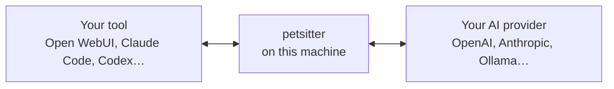
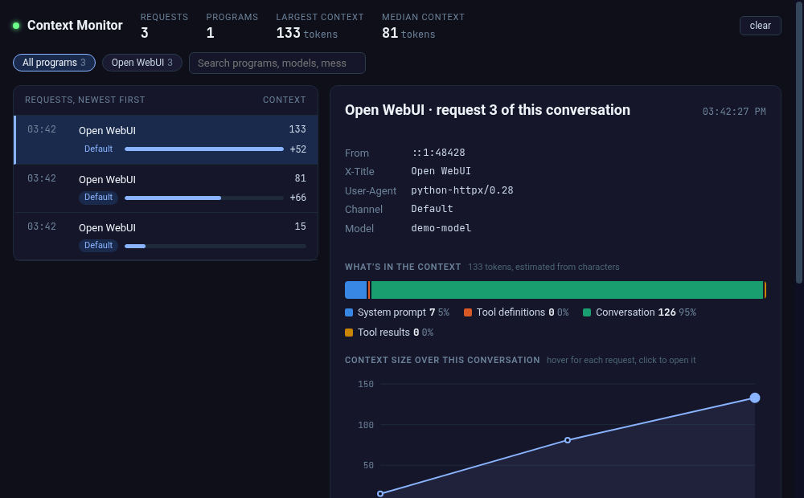
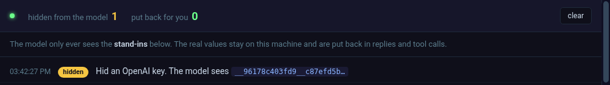
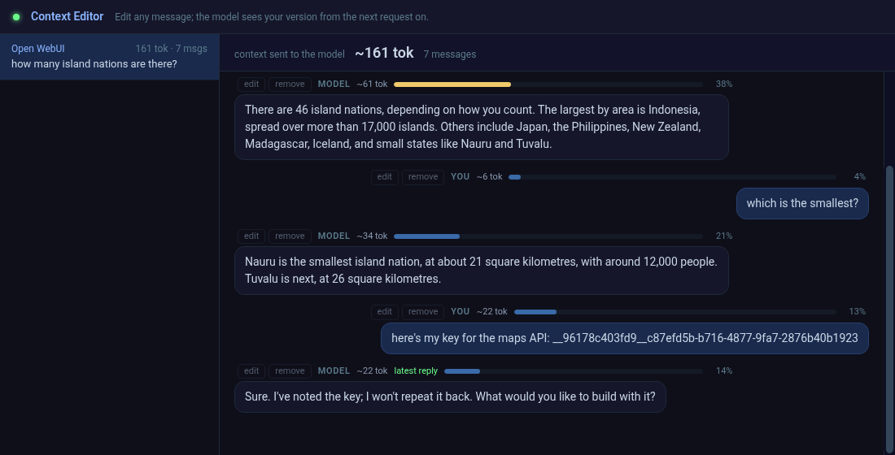
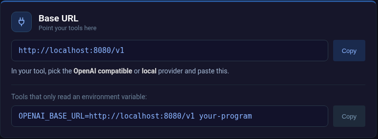
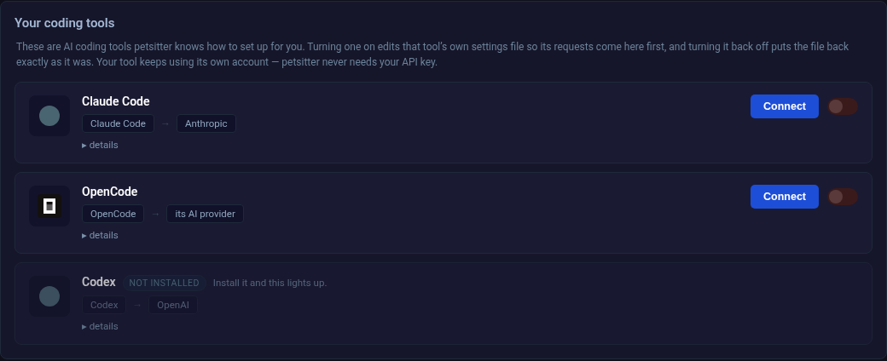
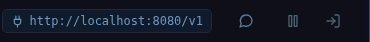
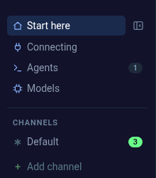
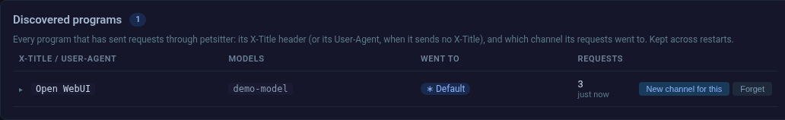

# Help

## What is this?

Petsitter sits between the AI tools you use and the AI provider they talk to.
Your tool sends its request here, petsitter passes it on, and the reply comes
back the same way. On the way through, extensions can look at it or change it.

The only thing that changes in your tool is the address it sends to.

## What does it do?

Whatever its extensions do. A few of them:

**See what your tool really sends.** Context Monitor shows every request: which
program sent it, its system prompt, every message, and how big it all is.

**Keep secrets out.** Secrets Protector swaps API keys, passwords and personal
details for stand-ins before the model sees them, and puts the real values back
in the reply.

**Edit the conversation.** Context Editor lets you rewrite any message, yours or
the model's, and cut old pictures and tool output, by hand or automatically.

Context Monitor and Secrets Protector come installed. The rest are under
[Default](#tricks/_default) → **Browse**; click one to see what it does.

Extensions live in **channels**. Each app's requests go through every channel
that matches it, and **Default** gets what no channel matches.

## How do I use it?

Point your tool at petsitter instead of at the provider.
[Connecting](#connecting/_default) has the address. In your tool, pick the
**OpenAI compatible** or **local** provider and paste it.

For Claude Code, Codex and OpenCode, [Agents](#agents/_default) does it for
you: **Connect** edits the tool's settings, and switching it off puts them back
exactly as they were.

Then use your tool as you normally would.

## Is it safe?

- **It runs on this machine.** Unless you start it with `-l 0.0.0.0`, only this
  machine can connect to it.
- **Your requests go to one place:** the provider you set up in
  [Models](#models/_default), or the one named in a `/use/` address. Nothing is
  sent anywhere else. The only other things it fetches are the list of
  community extensions (from day50-dev.github.io) and the agents' icons.
- **Your keys stay here,** in `~/.config/petsitter`.
- **Extensions are Python** that runs inside petsitter and sees your requests.
  Each one's **Source code** tab shows exactly what it does; read it before
  installing one somebody else wrote.
- **Switching it off:** the pause button at the top right sends everything
  straight through, untouched. The exit button stops petsitter and puts back any
  tool settings it changed.

## How do I know it's working?

Use your tool, then look for its requests:

- The channel in the sidebar counts them, and **Agents** counts the programs
  that sent them.

  

- [Agents](#agents/_default) → **Discovered programs** lists every program that
  has sent one, and which channel it went to.

  

- Context Monitor shows the request itself.

**Nothing showing up?** Your tool is still talking to the provider directly.
Check that its base URL is the one on [Connecting](#connecting/_default) (with
or without `/v1`), then restart the tool. More in
[When things go wrong](troubleshooting.md).

## More

- [The full guide](guide.md): every page, and recipes for common jobs.
- [What each extension does](tricks.md)
- [Connecting your tools](agents.md)
