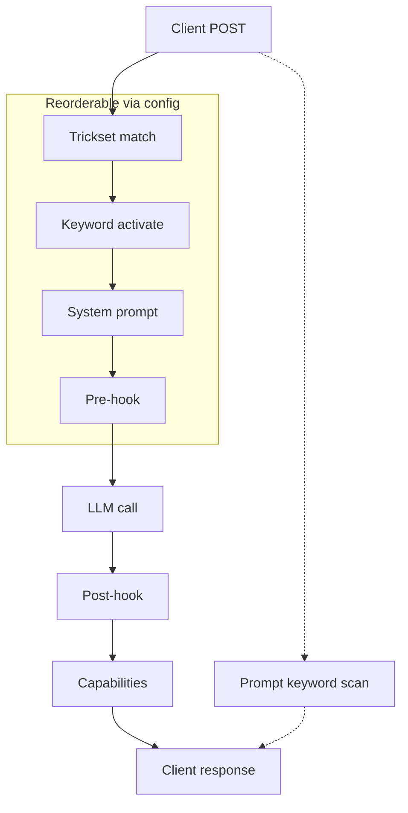

# Writing your own trick

The four hooks, the data each one gets, and the lifecycle around them.

[← back to the README](../README.md)

---

## Creating Custom Tricks


Tricks also have lifecycle hooks that run outside the request pipeline: `install()` on add, `startup()` on first concurrent use, `shutdown()` on last concurrent finish, and `uninstall()` on removal.

Here is a minimal trick that stops the model from using em-dashes (the long dash character that LLMs love to overuse) and replaces them with regular hyphens:

```python
"""No Em-Dash trick - replaces em-dashes with hyphens."""

from petsitter.trick import Trick

EMDASH = "\u2014"

class NoEmDashTrick(Trick):
    __brief__ = "Replaces em-dashes with hyphens in model responses"
    __display_name__ = "No Em-Dash"

    def system_prompt(self, to_add: str) -> str:
        return "Do NOT use em-dashes. Use a regular hyphen (-) instead."

    def post_hook(self, context: list) -> list:
        if not context:
            return context
        last = context[-1]
        content = last.get("content", "")
        if EMDASH in content:
            content = content.replace(EMDASH, "-")
            last["content"] = content
        return context
```

The `Trick` class has four optional request hooks and optional keyword activation:

### `system_prompt(to_add: str) -> str`

**When:** Called once per request, before any messages are sent to the model.

**Purpose:** Append instructions to the system prompt. This is how you "prime" the model to behave a certain way.

**Example:**
```python
def system_prompt(self, to_add: str) -> str:
    return "IMPORTANT: Respond only in valid JSON. No markdown, no explanations."
```

By default the returned text is **appended** to any existing system prompt, deduplicated so repeated injection doesn't stack. If a trick genuinely needs to *replace* the whole system prompt (e.g. swapping in a complete harness), set `replace_system_prompt = True` on the class:

```python
class SwapHarnessTrick(Trick):
    replace_system_prompt = True

    def system_prompt(self, to_add: str) -> str:
        return "FULL REPLACEMENT PROMPT"
```

### `pre_hook(context: list, params: dict) -> list`

**When:** Called after the system prompt is set, before the model receives the messages.

**Purpose:** Modify the conversation context. You can inject tool definitions, add few-shot examples, or restructure messages.

**Parameters:**
- `context`: List of message dicts (`[{"role": "user", "content": "..."}]`)
- `params`: Request parameters including `tools`, `temperature`, etc.

**Example:**
```python
def pre_hook(self, context: list, params: dict) -> list:
    if "tools" in params:
        tools_json = json.dumps(params["tools"])
        context[0]["content"] += f"\n\nAvailable tools: {tools_json}"
    return context
```

### `post_hook(context: list) -> list`

**When:** Called after the model responds, before the response goes back to your application.

**Purpose:** Validate, transform, or retry. This is where you can:
- Parse the response and convert it to a different format
- Detect when the model failed and call it again with feedback
- Extract tool calls from natural language

**Example (JSON validation with retry):**
```python
def post_hook(self, context: list) -> list:
    attempts = 3
    while attempts > 0:
        try:
            json.loads(context[-1]["content"])
            break
        except json.JSONDecodeError:
            attempts -= 1
            if attempts == 0:
                break
            context = callmodel(context, "That wasn't valid JSON. Try again.")
    return context
```

**Example (Tool call detection):**
```python
def post_hook(self, context: list) -> list:
    content = context[-1]["content"]
    if self._looks_like_tool_call(content):
        context[-1]["tool_calls"] = [self._parse_tool_call(content)]
        context[-1]["content"] = None
    return context
```

### `info(capabilities: dict) -> dict`

**When:** Called when building the response to your application.

**Purpose:** Declare what capabilities this trick provides. Some frameworks check for capabilities before using certain features.

**Example:**
```python
def info(self, capabilities: dict) -> dict:
    capabilities["json_mode"] = True
    capabilities["tools_support"] = True
    return capabilities
```

## Request Metadata

Hooks are handed the conversation, but not everything about the request that produced it — `post_hook` in particular receives only the message list, with no way back to the tools, model, or headers that came with it.

That information travels on a per-request metadata channel. It is backed by a `contextvar`, so every concurrent request gets its own and none can see another's:

```python
from petsitter.observability import request_meta

def pre_hook(self, context: list, params: dict) -> list:
    request_meta()["saw_tools"] = bool(params.get("tools"))
    return context

def post_hook(self, context: list) -> list:
    if not request_meta().get("saw_tools"):
        return context
    ...
```

The proxy fills it in before any hook runs:

| Key | Value |
|---|---|
| `request_id` | Short correlation id — the same one that prefixes this request's log lines |
| `payload` | The full incoming request body |
| `tools` | `payload["tools"]`, or `[]` |
| `model` | The requested model string |
| `stream` | Whether the client asked for a stream |

Tricks are free to add their own keys, and should, whenever they need to carry something from one hook to another within a single request.

**Do not use instance attributes for per-request state.** A trick object is shared across every concurrent request in its trickset, so a `self._something` written in `pre_hook` can be overwritten by a different request before `post_hook` reads it. Reserve instance attributes for configuration and for state that is deliberately long-lived — caches, counters, tallies.

Outside a request — in a lifecycle hook, or a direct call from a test — `request_meta()` returns an inert empty dict, so reads are safe and writes are discarded.

## Lifecycle Hooks

Every trick can implement up to 4 lifecycle hooks that the framework calls automatically:

### `install()`

Called once when the trick is first added to a trickset. Use for one-time setup - clone repos, download files, create resources:

```python
def install(self):
    self.cache_dir = Path("/tmp/my-trick-cache")
    self.cache_dir.mkdir(parents=True, exist_ok=True)
    download_model(self.cache_dir)
```

### `startup()`

Called when the first concurrent request starts using this trick (the internal run counter goes 0→1). Use for per-session initialization. It open connections and preloads models:

```python
def startup(self):
    self.session = httpx.Client()
```

### `shutdown()`

Called when the last concurrent request finishes using this trick (run counter goes 1→0), or during server shutdown for all active tricks. Use for per-session cleanup. It closes connections and release resources:

```python
def shutdown(self):
    self.session.close()
```

### `uninstall()`

Called when the trick is removed from a trickset. Undo anything done during `install()`:

```python
def uninstall(self):
    import shutil
    shutil.rmtree(self.cache_dir, ignore_errors=True)
```

The startup/shutdown hooks use a reference counter so multiple concurrent requests to the same trick won't trigger repeated startup/shutdown calls - `startup()` fires once for the first request, and `shutdown()` fires when the last one finishes.

## Keywords 

### Activation

Set `keywords` on your trick class to activate only when the user includes that word in their message - the keyword is stripped before the model sees it. See [`tricks/multiround.py`](tricks/multiround.py) for a working example.

```bash
# Trick fires when "multiround" is present
curl http://localhost:8080/v1/chat/completions \
  -d '{"messages":[{"role":"user","content":"multiround explain the CAP theorem"}]}'

# Trick does nothing without the keyword
curl http://localhost:8080/v1/chat/completions \
  -d '{"messages":[{"role":"user","content":"explain the CAP theorem"}]}'
```

### Prompts

Prompt keywords let you inject commands to petsitter itself inline in your message using the format `(<keyword>: <request>)`. The framework scans for registered keywords, strips the matching pattern before the model sees it, and routes the request to the appropriate handler.

The syntax is forgiving - a registered keyword can be triggered any of these ways:

- `(swapharness: opencode/claude.md)` - parenthesized with a request
- `(swapharness:opencode/claude.md)` - the space after the colon is optional
- `(swapharness:)` or `(swapharness)` - empty request (e.g. list the harness tree)
- just `swapharness` - a bare keyword alone in a message means an empty request

This is separate from trick [keyword activation](#activation) - keywords activate or deactivate tricks for the current request, while **prompt keywords** are commands to petsitter that bypass the model entirely.

### How to register a prompt keyword

Set `prompt_keyword` on your Trick subclass:

```python
class MyCommandTrick(Trick):
    prompt_keyword = "mycommand"
    __brief__ = "Handles (mycommand: ...) inline requests"

    def handle_prompt_keyword(self, request: str) -> dict | None:
        return {"role": "assistant", "content": f"You asked: {request}"}
```

The method receives the text after `mycommand: ` and can return:
- A message dict - injected as the model response (bypasses the upstream call)
- `None` - the pattern is stripped but the normal pipeline continues

### Notes

- Execution goes in order of the prompt reference. Unrecognized prompt keywords are passed through and surface as a non-critical error in the response along with the rest of the response
- The pattern `(<keyword>: <request>)` properly handles nested parentheses by tracking a depth counter.
- Keyword matching is case-insensitive.
- If the handler raises, an error message is returned as the assistant response.

