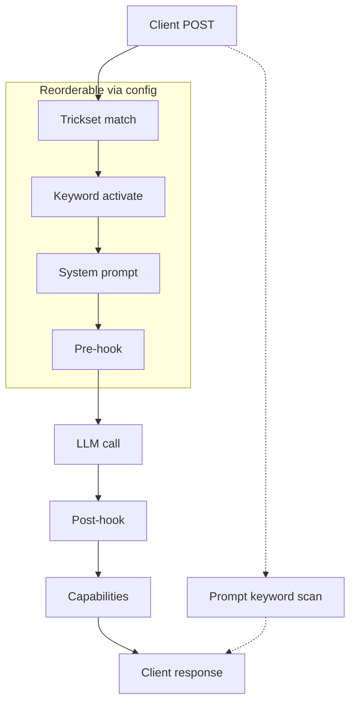

# Writing your own trick

The hooks, the data each one gets, and everything around them: settings, the
Live tab, streaming, problems, and testing. (The dashboard calls tricks
*extensions* and tricksets *channels*; the code uses the older names.)

[← back to the README](../README.md)

---

## Creating Custom Tricks

```mermaid
flowchart TD
  A[Client POST] --> B
  A -.-> K[Prompt keyword scan]
  subgraph config[Reorderable via config]
    B[Trickset match] --> C[Keyword activate]
    C --> D[System prompt]
    D --> E[Pre-hook]
  end
  E --> L[LLM call]
  L --> F[Post-hook]
  F --> G[Capabilities]
  G --> Z[Client response]
  K -.-> Z
```

Tricks also have lifecycle hooks that run outside the request pipeline: `install()` on add, `startup()` on first concurrent use, `shutdown()` on last concurrent finish, and `uninstall()` on removal.

Here is a minimal trick that stops the model from using em-dashes (the long dash character that LLMs love to overuse) and replaces them with regular hyphens:

```python
"""Replaces em-dashes in the model's replies with plain hyphens.

## How to use

Install it. Nothing to type; it works on every reply in the channel.

## How it works

- `system_prompt` asks the model not to use them; `post_hook` fixes any that
  slip through, as the reply streams.
"""

from petsitter.trick import Trick

EMDASH = "\u2014"

class NoEmDashTrick(Trick):
    __brief__ = "Replaces em-dashes with hyphens in model responses"
    __display_name__ = "No Em-Dash"
    __category__ = "Output & Style"
    needs_window = 1   # one character at a time, so the reply still streams

    def system_prompt(self, to_add: str) -> str:
        return "Do NOT use em-dashes. Use a regular hyphen (-) instead."

    def post_hook(self, context: list) -> list:
        last = context[-1] if context else {}
        content = last.get("content")
        if isinstance(content, str) and EMDASH in content:
            last["content"] = content.replace(EMDASH, "-")
            self.report(f"Replaced {content.count(EMDASH)} em-dashes in a reply")
        return context
```

The module docstring is the extension's page in the dashboard: its first line
is the tagline under the name, and the rest is rendered as Markdown. Write it
for the person installing the extension: what it does, then `## How to use`,
then `## How it works`. `__brief__` is the one-line summary in lists and
`__category__` groups it with similar extensions.

A trick has five optional request hooks (the four below, plus
[`handle_prompt_keyword`](#prompts)) and optional keyword activation:

### `system_prompt(to_add: str) -> str`

**When:** Called once per request, before any messages are sent to the model.

**Purpose:** Append instructions to the system prompt. This is how you "prime" the model to behave a certain way.

**Example:**
```python
def system_prompt(self, to_add: str) -> str:
    return "IMPORTANT: Respond only in valid JSON. No markdown, no explanations."
```

By default the returned text is **appended** to any existing system prompt, deduplicated so repeated injection doesn't stack. If a trick genuinely needs to *replace* the whole system prompt (e.g. swapping in a complete harness), set `replace_system_prompt = True` on the class:

```python
class SwapHarnessTrick(Trick):
    replace_system_prompt = True

    def system_prompt(self, to_add: str) -> str:
        return "FULL REPLACEMENT PROMPT"
```

### `pre_hook(context: list, params: dict) -> list`

**When:** Called after the system prompt is set, before the model receives the messages.

**Purpose:** Modify the conversation context. You can inject tool definitions, add few-shot examples, or restructure messages.

**Parameters:**
- `context`: List of message dicts (`[{"role": "user", "content": "..."}]`)
- `params`: Request parameters including `tools`, `temperature`, etc.

A message's `content` is usually a string, but it can also be `None` (an
assistant turn that only calls tools) or a list of parts
(`[{"type": "text", "text": "..."}, {"type": "image_url", ...}]`), which some
clients send. A tool's result arrives as
`{"role": "tool", "tool_call_id": "...", "content": "..."}`. Anthropic-style
requests (Claude Code) are converted to this same shape before any hook runs,
so one trick works for every client.

Don't keep per-request state on `self`: one trick instance serves every
concurrent request in its channel. Carry it to `post_hook` in
[`request_meta()`](#request-metadata).

**Example:**
```python
def pre_hook(self, context: list, params: dict) -> list:
    if "tools" in params:
        tools_json = json.dumps(params["tools"])
        context[0]["content"] += f"\n\nAvailable tools: {tools_json}"
    return context
```

### `post_hook(context: list) -> list`

**When:** Called after the model responds, before the response goes back to your application.

**Purpose:** Validate, transform, or retry. This is where you can:
- Parse the response and convert it to a different format
- Detect when the model failed and call it again with feedback
- Extract tool calls from natural language

**Example (JSON validation with retry):**
```python
def post_hook(self, context: list) -> list:
    attempts = 3
    while attempts > 0:
        try:
            json.loads(context[-1]["content"])
            break
        except json.JSONDecodeError:
            attempts -= 1
            if attempts == 0:
                break
            context = callmodel(context, "That wasn't valid JSON. Try again.")
    return context
```

**Example (Tool call detection):**
```python
def post_hook(self, context: list) -> list:
    content = context[-1]["content"]
    if self._looks_like_tool_call(content):
        context[-1]["tool_calls"] = [self._parse_tool_call(content)]
        context[-1]["content"] = None
    return context
```

### `info(capabilities: dict) -> dict`

**When:** Called when building the response to your application.

**Purpose:** Declare what capabilities this trick provides. Some frameworks check for capabilities before using certain features.

**Example:**
```python
def info(self, capabilities: dict) -> dict:
    capabilities["json_mode"] = True
    capabilities["tools_support"] = True
    return capabilities
```

## Settings

Give a trick settings with `config_fields`, and the dashboard shows a form for
them (the extension's **Settings** button). Values arrive as attributes on
`self`:

```python
class LoggerTrick(Trick):
    config_fields = [
        {"key": "path", "label": "Log folder", "type": "path",
         "default": "~/.cache/petsitter/traffic",
         "description": "Where to write the log files."},
    ]

    def pre_hook(self, context, params):
        path = getattr(self, "path", None) or "~/.cache/petsitter/traffic"
        ...
```

Each field has a `key` (the attribute name) and `label`, and optionally a
`description`, a `type` (`"text"`, `"number"`, `"boolean"` or `"path"`), a
`default`, and `required`. Override `configure(config)` (calling
`super().configure(config)`) to react when a value changes. The values in use
are shown on the extension's page and on its Live tab.

## Live page

Every trick gets a **Live** tab on its extension page in the dashboard, and
installing it (or clicking it once installed) opens straight onto that tab.

Most tricks only need to say what they did. Call `self.report()` and the
standard Live page shows it as a timestamped log; no UI to write:

```python
def post_hook(self, context):
    n = reply.count("\u2014")
    if n:
        ...
        self.report(f"Replaced {n} em-dashes in a reply")
    return context

self.report("Rephrased a message", before=old[:300], after=new[:300])  # details expand
```

Only the trick knows what it changed (it can edit anything in flight however it
likes), so reporting is its job; the framework can't infer it.

A trick that wants more can ship its own page instead. It is a dumb container:
petsitter serves your HTML and two pipes, and puts no schema on either.

```python
class MyTrick(Trick):
    ui_page = "my_trick.html"          # a file next to my_trick.py

    def post_hook(self, context):
        self.publish({"saw": len(context)})   # anything JSON-able
        return context

    def ui_action(self, data):         # optional: POSTs from the page
        if data.get("action") == "clear":
            self.live_feed.clear()
        return {"ok": True}
```

The page is served at `/api/tricks/ui/<id>/`, so it uses relative URLs:

```js
const events = new EventSource("events");   // the recent past, then live
events.onmessage = m => draw(JSON.parse(m.data));
fetch("action", {method: "POST", headers: {"Content-Type": "application/json"},
                 body: JSON.stringify({action: "clear"})});
```

- `EventSource("events")` doesn't cost a connection of its own: petsitter adds
  a small script when it serves the page, and the stream goes over the one
  connection the whole browser shares with the dashboard. (A browser allows
  only 6 connections to a host across all its tabs.) Write it as a normal
  `EventSource`; nothing else changes.
- `publish()` is cheap and never blocks. The last 500 events are kept in memory,
  so opening the tab after using your tool still shows what happened.
- For a single-file trick, override `ui_html()` and return the HTML as a string.
- The page runs with the dashboard's own access, same as your trick's Python.
- Never publish anything you wouldn't show on screen. Secrets Protector publishes
  what kind of secret it hid and the stand-in, never the value.
- Examples: `tricks/tool_monitor.py` + `tool_monitor.html` (a full viewer, with a
  built-in demo) and `tricks/secrets_protector.py` + `secrets_protector.html`
  (a small activity log).

## The request ID

`self.request_id` is the ID of the request being handled. Petsitter assigns it
the moment a request arrives and keeps it until the reply goes back, so it's
the same in `pre_hook`, `post_hook` and anything they log, and the same one
petsitter's own log lines carry (`[ab12cd34] ...`). Tag your log lines with it
so lines about one request, from different places, can be lined up: the
Traffic Logger does, so two of them (one first in a channel, one last) show
exactly what the tricks in between changed. It's `""` outside a request.

## Reporting problems

If a trick can't do all it says (a missing optional dependency, a setting
that can't work), return what's wrong from `problems()`:

```python
def problems(self) -> list[str]:
    if not shutil.which("rg"):
        return ["ripgrep isn't installed, so searches fall back to grep and are "
                "much slower. Install it with `apt install ripgrep`."]
    return []
```

Each entry is a sentence saying what's wrong and how to fix it. Text in
backticks is shown as code. The dashboard puts a "!" on the extension and on
its channel in the sidebar, and shows the sentences in a card on the
extension's page. It's called whenever the dashboard lists extensions, so keep
it cheap. Return `[]` when all is well (the default).

## Streaming replies

A reply streams to the client as the model writes it. A trick with a
`post_hook` says how much of the reply it needs to see at once with
`needs_window`:

| `needs_window` | Meaning | Examples |
|---|---|---|
| `-1` (default) | The whole reply. It's held until complete. | Code Validator, JSON mode |
| `0` | None. The `post_hook` only looks, and runs once the reply has been sent, on the reassembled reply. What it changes is ignored. | Traffic Logger, Tool Monitor |
| `N` | The last `N` characters. The reply streams with only those held back. | No em-dash (`1`), Secrets Protector (`52`, the length of one stand-in) |

The channel uses the largest window among its tricks, and `-1` wins outright.
With a window of `N`, the held-back tail plus the newly arrived text goes through
the rewriting `post_hook`s as an ordinary assistant message. Everything but the
last `N` characters of the result is sent. So anything a trick looks for that is
at most `N` characters long is always seen whole before any of it is sent. Tool
calls are held to the end and reach the `post_hook` whole.

A trick with a window must meet two conditions:

- **Local:** its `post_hook` is right on any stretch of the reply, not only on
  the whole thing. Replacing a character is local; capitalizing the first word
  isn't.
- **Idempotent:** run again on its own output, it changes nothing, because the
  held-back tail goes through more than once.

`needs_window` can be a property when the size depends on state the trick has
at the start of the reply (after `pre_hook`).

While a reply is held whole, petsitter sends heartbeats so the client's timeout
doesn't fire during a long generation. These are SSE comment lines on
`/v1/chat/completions` and Anthropic `ping` events on `/v1/messages`. On
`/v1/messages`, thinking blocks always pass through unchanged, and with no
window the whole event stream does.

## Request Metadata

Hooks are handed the conversation, but not everything about the request that produced it — `post_hook` in particular receives only the message list, with no way back to the tools, model, or headers that came with it.

That information travels on a per-request metadata channel. It is backed by a `contextvar`, so every concurrent request gets its own and none can see another's:

```python
from petsitter.observability import request_meta

def pre_hook(self, context: list, params: dict) -> list:
    request_meta()["saw_tools"] = bool(params.get("tools"))
    return context

def post_hook(self, context: list) -> list:
    if not request_meta().get("saw_tools"):
        return context
    ...
```

The proxy fills it in before any hook runs:

| Key | Value |
|---|---|
| `request_id` | Short correlation id — the same one that prefixes this request's log lines |
| `payload` | The full incoming request body |
| `tools` | `payload["tools"]`, or `[]` |
| `model` | The requested model string |
| `stream` | Whether the client asked for a stream |

Tricks are free to add their own keys, and should, whenever they need to carry something from one hook to another within a single request.

**Do not use instance attributes for per-request state.** A trick object is shared across every concurrent request in its trickset, so a `self._something` written in `pre_hook` can be overwritten by a different request before `post_hook` reads it. Reserve instance attributes for configuration and for state that is deliberately long-lived — caches, counters, tallies.

Outside a request — in a lifecycle hook, or a direct call from a test — `request_meta()` returns an inert empty dict, so reads are safe and writes are discarded.

## Testing

- **Unit tests.** Instantiate the trick and call its hooks with plain lists
  of message dicts; `tests/` has plenty to copy. Wrap code that reads
  `request_meta()` in `start_request_meta()` / `reset_request_meta(token)`.
- **Try it.** In the dashboard, open the channel and click **Try it**. Every
  reply shows a pill per extension, lit when it changed something, and the
  extension's **Live** tab shows what it `report()`ed.
- **Tool calls.** Try it has a **Table** the model can use through three
  tools: `get_table()`, `get_value(key)` and `set_value(key, value)`. The
  panel runs them itself. Put values in the table and ask the model to read or
  change them: that sends your trick tool results (`role: "tool"` messages)
  and the model's tool calls without needing a real agent. For example, with
  Secrets Protector on, put a password in the table and ask the model to copy
  it to another key. The model only ever sees a stand-in, and the copy holds
  the real value.

## Loading it

```bash
pet add _default path/to/my_trick.py          # into the Default channel
curl -X POST localhost:8080/readconfig         # a running petsitter picks it up
```

Or, with petsitter running: `POST /api/tricks/load` with
`{"path": "path/to/my_trick.py", "trickset": "_default"}`.

## Lifecycle Hooks

Every trick can implement up to 4 lifecycle hooks that the framework calls automatically:

### `install()`

Called once when the trick is first added to a trickset. Use for one-time setup - clone repos, download files, create resources:

```python
def install(self):
    self.cache_dir = Path("/tmp/my-trick-cache")
    self.cache_dir.mkdir(parents=True, exist_ok=True)
    download_model(self.cache_dir)
```

### `startup()`

Called when the first concurrent request starts using this trick (the internal run counter goes 0→1). Use for per-session initialization. It open connections and preloads models:

```python
def startup(self):
    self.session = httpx.Client()
```

### `shutdown()`

Called when the last concurrent request finishes using this trick (run counter goes 1→0), or during server shutdown for all active tricks. Use for per-session cleanup. It closes connections and release resources:

```python
def shutdown(self):
    self.session.close()
```

### `uninstall()`

Called when the trick is removed from a trickset. Undo anything done during `install()`:

```python
def uninstall(self):
    import shutil
    shutil.rmtree(self.cache_dir, ignore_errors=True)
```

The startup/shutdown hooks use a reference counter so multiple concurrent requests to the same trick won't trigger repeated startup/shutdown calls - `startup()` fires once for the first request, and `shutdown()` fires when the last one finishes.

## Keywords 

### Activation

Set `keywords` on your trick class to activate only when the user includes that word in their message - the keyword is stripped before the model sees it. See [`tricks/multiround.py`](tricks/multiround.py) for a working example.

```bash
# Trick fires when "multiround" is present
curl http://localhost:8080/v1/chat/completions \
  -d '{"messages":[{"role":"user","content":"multiround explain the CAP theorem"}]}'

# Trick does nothing without the keyword
curl http://localhost:8080/v1/chat/completions \
  -d '{"messages":[{"role":"user","content":"explain the CAP theorem"}]}'
```

### Prompts

Prompt keywords let you inject commands to petsitter itself inline in your message using the format `(<keyword>: <request>)`. The framework scans for registered keywords, strips the matching pattern before the model sees it, and routes the request to the appropriate handler.

The syntax is forgiving - a registered keyword can be triggered any of these ways:

- `(swapharness: opencode/claude.md)` - parenthesized with a request
- `(swapharness:opencode/claude.md)` - the space after the colon is optional
- `(swapharness:)` or `(swapharness)` - empty request (e.g. list the harness tree)
- just `swapharness` - a bare keyword alone in a message means an empty request

This is separate from trick [keyword activation](#activation) - keywords activate or deactivate tricks for the current request, while **prompt keywords** are commands to petsitter that bypass the model entirely.

### How to register a prompt keyword

Set `prompt_keyword` on your Trick subclass:

```python
class MyCommandTrick(Trick):
    prompt_keyword = "mycommand"
    __brief__ = "Handles (mycommand: ...) inline requests"

    def handle_prompt_keyword(self, request: str) -> dict | None:
        return {"role": "assistant", "content": f"You asked: {request}"}
```

The method receives the text after `mycommand: ` and can return:
- A message dict - injected as the model response (bypasses the upstream call)
- `None` - the pattern is stripped but the normal pipeline continues

### Notes

- Execution goes in order of the prompt reference. Unrecognized prompt keywords are passed through and surface as a non-critical error in the response along with the rest of the response
- The pattern `(<keyword>: <request>)` properly handles nested parentheses by tracking a depth counter.
- A second, sed-style form `(<keyword>=<D><request><D>)` takes the request verbatim between a delimiter `D` of the user's choosing, for requests with unbalanced parentheses or significant whitespace: `(secret=|ab)c|)`. One optional space is allowed on either side of `=`. This form only counts when it names a registered keyword, so code like `f(x = 'a')` is left alone.
- Set `strip_prompt_keyword = False` on a trick to have the framework leave its pattern where the user typed it, on every turn, for the trick's own `pre_hook` to rewrite in place (secrets_protector does this). `handle_prompt_keyword` isn't called for it, and `petsitter.trick.find_prompt_keyword_patterns` gives the trick the same parser the framework uses.
- Inside `handle_prompt_keyword`, `petsitter.trick.transformed_messages()`
  gives the conversation as the channel's extensions would send it to the
  model (system prompts added, pre_hooks run, on a copy; no model call, and
  extensions with `needs_window = 0` are skipped so they record nothing). The
  `messages` argument is the conversation as the tool sent it. Export It uses
  both for `(exportit: both)`.
- Keyword matching is case-insensitive.
- If the handler raises, an error message is returned as the assistant response.

